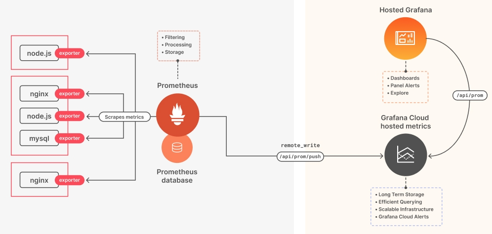
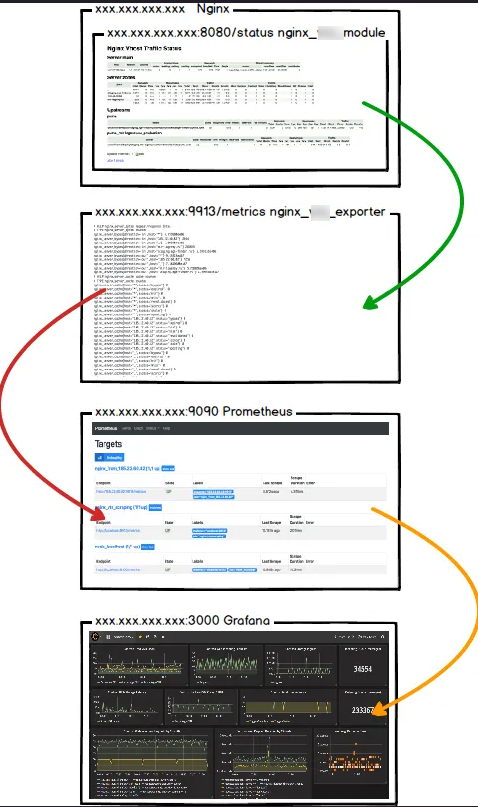

# LAB Prometheus

## **Introduction à Prometheus**

- **Qu'est-ce que Prometheus ?**
  - Prometheus est un système de surveillance open-source pour collecter, traiter et stocker des métriques.
  - Il utilise un modèle de données clé-valeur et propose des requêtes flexibles avec PromQL.

- **Architecture de Prometheus**
  - Composants principaux : Serveur Prometheus, métriques exportées, stockage des métriques, explorateur graphique.
  - Modèle de collecte pull : Prometheus interroge périodiquement les cibles pour obtenir des métriques.

## **Partie 1: Utilisation de PromQL**

- **Introduction à PromQL**
  - PromQL (Prometheus Query Language) pour interroger et manipuler les métriques.
  - Exemples : 

`rate(node_cpu_seconds_total{mode="system"}[1m])`

`rate(node_network_receive_bytes_total[1m])`

- **Exercices Pratiques**
  1. Requête PromQL pour afficher le nombre d'instances de l'application en cours d'exécution.
  2. Utilisation de `rate()` pour calculer le taux de croissance des requêtes HTTP sur les 5 dernières minutes.

---

## **Partie 2: Configuration du Service d'Alerte par SMTP**

- **Configuration d'Alerte avec Prometheus**
  - Règles d'alerte dans le fichier de configuration Prometheus.
  - Configuration du service d'alerte pour envoi d'e-mails via SMTP.

- **Exercices Pratiques**
  1. Ajout d'une règle d'alerte pour déclenchement en cas de taux d'erreurs HTTP critique.
  2. Configuration de Prometheus pour envoyer des alertes par e-mail.

### > Utiliser l'outil pour générer du traffic sur NGINX (script ou software) 
[Script_python_stress_test_HTTP](script_tools/stress_test.py)

---

## **Partie 3: Supervision d'un Hôte en SNMP**

- **Supervision avec SNMP**
  - Utilisation du module `snmp_exporter` pour collecter des métriques SNMP.
  - Configuration de Prometheus pour récupérer ces métriques.

- **Exercices Pratiques**
  1. Installation et configuration de `snmp_exporter` sur l'hôte Linux.
  2. Ajout d'une nouvelle cible dans la configuration de Prometheus pour la surveillance SNMP.

---

## **Partie 4: Création d'un Tableau de Bord Grafana**

- **Intégration avec Grafana**
  - Grafana connecté à Prometheus comme source de données.
  - Création de tableaux de bord visuels avec les métriques Prometheus.

- **Exercices Pratiques**
  1. Vérifier que la connexion à Prometheus est fonctionnelle.
  2. Création d'un tableau de bord affichant les métriques de performance NGINX.

### > Utiliser l'outil pour générer du traffic sur NGINX2 (script ou software)
[Script_python_stress_test_HTTP](script_tools/stress_test.py)

---

# La centralisation de logs

Centraliser ses logs est un sujet important dans le domaine de la gestion des systèmes et réseaux, surtout en entreprise.

### Contexte d'utilisation en Entreprise

1. **Volume de Données** : Les entreprises génèrent un volume considérable de données de logs à partir de multiples sources - serveurs, applications, équipements réseau, etc.
2. **Complexité des Environnements IT** : Avec des infrastructures informatiques de plus en plus complexes, il devient difficile de surveiller et d'analyser efficacement les logs de manière isolée.
3. **Conformité et Réglementations** : Les entreprises doivent se conformer à diverses réglementations qui exigent la collecte, le stockage et l'analyse des logs pour des audits de sécurité et des analyses forensiques.

### Pourquoi les Entreprises Centralisent et Archivent les Logs

1. **Sécurité et Surveillance** : La centralisation des logs permet une surveillance en temps réel pour détecter et réagir rapidement aux incidents de sécurité.
2. **Analyse et Diagnostique** : Facilite l'analyse des logs pour identifier les tendances, les anomalies, et pour diagnostiquer les problèmes systèmes ou de réseau.
3. **Conformité** : Aide à respecter les réglementations en matière de conservation des données et de reporting de sécurité.
4. **Optimisation des Ressources** : Réduit la charge sur les systèmes individuels et optimise les performances en centralisant le stockage et l'analyse des logs.

### Fonctions de Graylog en Cybersécurité

1. **Corrélation de Logs** : Graylog peut corréler des données de logs provenant de diverses sources pour identifier des modèles complexes d'activités suspectes.
2. **Parsing et Normalisation** : Graylog parse et normalise les logs pour une meilleure compréhension et analyse, convertissant les données brutes en informations exploitables.
3. **Alertes en Temps Réel** : Configurer des alertes basées sur des critères spécifiques pour une réaction rapide aux incidents.

4. **Tableaux de Bord et Reporting** : Des tableaux de bord personnalisables pour visualiser les tendances et les menaces, facilitant la prise de décision en matière de sécurité.
5. **Intégration avec d'Autres Outils** : Capacité à intégrer avec d'autres outils de sécurité pour une approche de sécurité plus holistique.

