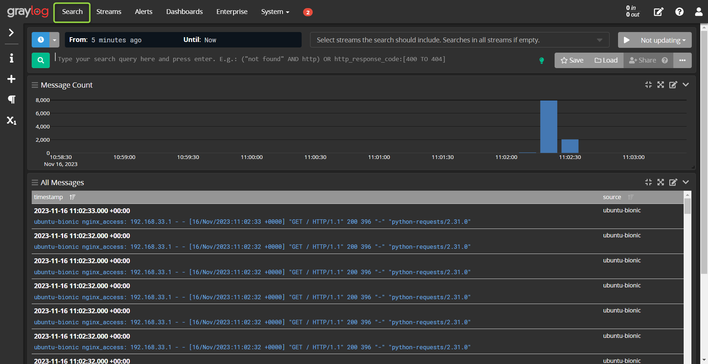

# LAB infra Vagrant - Nginx > Prometheus - Grafana - Graylog - v3

### Diagram Topologie


### Prérequis Virtualbox
- Télécharger l'extension pack Virtualbox pour votre version de VB **Oracle_VM_VirtualBox_Extension_Pack-7.0.XXX** , ainsi que l'ISO **VBoxGuestAdditions_7.0.XXX.iso**
- Importer l'extension pack Virtualbox, utiliser `Ctrl+T` pour y accéder et importer > `Oracle_VM_VirtualBox_Extension_Pack-7.0.12.vbox-extpack`
- Importer dans le gestionnaire de média, utiliser `Ctrl+D` pour y accéder et ajouter l'iso > `VBoxGuestAdditions_7.0.XXXX.iso`

### Prérequis Vagrant
- Télécharger Vagrant si vous ne l'avez pas
- Télécharger le repôt Git
- Créer un dossier dans votre répertoire perso Windows - `vagrant-conf`
- Dézipper les fichier contenu dans le dossier compressé dans le répertoire créer précédemment
- Ouvrir le dossier `vagrant-conf` avec **VScode** ou un Terminal 
- Se placer dans le path du répertoire comportant le vangrantfile
- Lancer la commande `vangrant up`
- Accepter les pop-up UAC Windows pour Virtuabox

### Services
- Se référer au Diagram de la toplogie ci-dessus pour les IP et tester les services
- Login Grafana et Graylog (admin/admin)


### Stress test HTTP - Python

- Installer `pip3 install requests` et autre module nécessaires si vous n'en disposez pas  


# LAB - Collecter les metrics Nginx sur Prometheus
## DEJA CONFIGER AVEC VAGRANT PROCCESS A TITRE D'EXEMPLE :warning: 

Pour collecter des métriques d'un serveur web Nginx sur Ubuntu 20.04 à l'aide de Prometheus, vous devez configurer Prometheus pour qu'il scrape les données de Nginx. Voici les étapes à suivre :

### Sur le serveur web Nginx (Ubuntu 20.04) 

### DEJA REALISER AVEC VAGRANT PROCCESS A TITRE D'EXEMPLE :warning: 

### Configurer le site par défaut pour exposer les métriques de Nginx

`nano /etc/nginx/sites-available/default`

```
   server {
      listen 80 default_server;
      listen [::]:80 default_server;

      index index.html index.htm index.nginx-debian.html;

      server_name _;

      root /var/www/html;

      location / {
               try_files $uri $uri/ =404;
      }

      location /metrics {
      stub_status on;
      access_log off;
      allow 127.0.0.1;
      allow 192.168.33.10;
      deny all;

      }

   }
```

### Rédémarrer NGINX
`sudo systemctl restart nginx`

### Installer nginx-prometheus-exporter
```
wget https://github.com/nginxinc/nginx-prometheus-exporter/releases/download/v0.9.0/nginx-prometheus-exporter_0.9.0_linux_amd64.tar.gz
```

`tar xzf nginx-prometheus-exporter_0.9.0_linux_amd64.tar.gz`
`sudo cp nginx-prometheus-exporter /usr/local/bin/`

### Créer le service systemd pour nginx-prometheus-exporter
`nano /etc/systemd/system/nginx-prometheus-exporter.service`

      [Unit]
      Description=Nginx Prometheus Exporter
      Wants=network-online.target
      After=network-online.target

      [Service]
      User=root
      Group=root
      Type=simple
      ExecStart=/usr/local/bin/nginx-prometheus-exporter -nginx.scrape-uri=http://127.0.0.1/metrics

      [Install]
      WantedBy=multi-user.target

      
### Démarrer et activer le service nginx-prometheus-exporter

`sudo systemctl daemon-reload`
`sudo systemctl start nginx-prometheus-exporter`
`sudo systemctl enable nginx-prometheus-exporter`


- L'option `-nginx.scrape-uri` doit pointer vers l'URI de votre serveur Nginx où les métriques sont exposées (par exemple, `http://localhost/metrics` si vous avez configuré Nginx comme indiqué précédemment).

- Assurez-vous que l'utilisateur `prometheus` et le groupe `prometheus` existent sur votre système ou remplacez-les par des utilisateurs/groupes appropriés.


3. **Recharger le démon systemd** :
- Après avoir enregistré et fermé le fichier, exécutez la commande suivante pour que systemd prenne en compte votre nouveau service :
```bash
sudo systemctl daemon-reload
```

4. **Démarrer le service `nginx-prometheus-exporter`** :
- Utilisez la commande suivante pour démarrer le service :
```bash
sudo systemctl start nginx-prometheus-exporter
```

5. **Activer le service au démarrage** :
- Pour que le service démarre automatiquement au démarrage du système, exécutez :
```bash
sudo systemctl enable nginx-prometheus-exporter
```

6. **Vérifier l'état du service** :
- Pour vous assurer que le service fonctionne correctement, vous pouvez vérifier son état :
```bash
sudo systemctl status nginx-prometheus-exporter
```

En suivant ces étapes, `nginx-prometheus-exporter` fonctionnera comme un service systemd, démarrant automatiquement à chaque démarrage du système et pouvant être géré avec les commandes systemd standard (`start`, `stop`, `restart`, `status`).

## Sur le serveur Prometheus (Ubuntu 20.04) :

1. **Configurer Prometheus pour scraper les métriques Nginx** :
- Ouvrez le fichier de configuration de Prometheus (`/etc/prometheus/prometheus.yml`).
- Ajoutez la cible Nginx sous `scrape_configs` :
   ```yaml
   - job_name: "nginx"
      scrape_interval: 5s
      metrics_path: '/metrics'
      static_configs:
      - targets: ["192.168.33.11:9113"]
   ```

2. **Redémarrer Prometheus** :
   - Exécutez `sudo systemctl restart prometheus` pour appliquer les modifications.

Après avoir configuré les deux serveurs, Prometheus commencera à scraper les métriques de Nginx à l'intervalle spécifié dans sa configuration. Vous pouvez visualiser ces métriques via l'interface utilisateur web de Prometheus ou les utiliser dans des tableaux de bord Grafana.

### FIN DU PROCESS DEJA REALISER AVEC VAGRANTFILE

# LAB- Interroger PromQL en GUI

### :warning Penser à générer du trafic avec les scripts de stress test 

[Script_python_stress_test_HTTP](script_tools/stress_test.py)

Dans Prometheus, vous pouvez utiliser différentes expressions pour interroger les métriques collectées depuis votre serveur Nginx. Voici quelques exemples d'expressions courantes que vous pouvez utiliser pour visualiser les métriques de Nginx :

1. **Nombre total de requêtes traitées** :
```
nginx_http_requests_total
```
   Cette expression affiche le nombre total de requêtes HTTP traitées par le serveur Nginx.

2. **Taux de requêtes HTTP** :
```
rate(nginx_http_requests_total[5m])
```
   Calcule le taux de requêtes HTTP par seconde sur les dernières 5 minutes.

3. **Nombre de connexions actives** :
```
nginx_connections_active
```
   Affiche le nombre de connexions actives à un moment donné.

4. **Connexions acceptées** :
```
nginx_connections_accepted
```
   Donne le nombre total de connexions acceptées par le serveur.

5. **Connexions en attente** :
```
nginx_connections_waiting
```
   Affiche le nombre de connexions en attente.

6. **Taux d'erreurs 5xx** :
```
sum(rate(nginx_http_responses_total{status=~"5.."}[5m]))
```
   Montre le taux d'erreurs 5xx (comme 500, 502, 503) sur les dernières 5 minutes.

   7. **Temps de réponse moyen** :
```
nginx_http_request_duration_seconds_avg
```
   Donne le temps de réponse moyen des requêtes.

8. **Nombre de requêtes par statut HTTP** :
```
nginx_http_responses_total{status="200"}
```

Remplacez "200" par le code de statut souhaité pour afficher le nombre de réponses avec ce statut.

Ces expressions peuvent être utilisées dans l'interface utilisateur web de Prometheus ou intégrées dans des tableaux de bord Grafana pour une visualisation plus avancée et des analyses en temps réel. N'oubliez pas que les métriques exactes disponibles peuvent varier en fonction de la version de l'exportateur Nginx Prometheus que vous utilisez.

 


# Dashboard Grafana > Prometheus > nginx-prometheus-exporter

[Link vidéo](https://www.youtube.com/watch?v=H45YV-l6GOY)

## Dashboard officiel - nginx-prometheus-exporter > Grafana
https://grafana.com/grafana/dashboards/12708-nginx/

# Alerting Grafana > Discord

Voici un guide complet pour configurer l'alerting dans Grafana, en se concentrant spécifiquement sur la surveillance du nombre de connexions actives à Nginx via nginx-prometheus-exporter et en envoyant des alertes via Discord 

### Configuration des Métriques dans Grafana
1. **Création d'un Panneau (Panel) dans Grafana** :
   - Accédez à votre tableau de bord Grafana.
   - Ajoutez un nouveau panneau pour visualiser les métriques de Nginx.
   - Utilisez une requête PromQL pour afficher le nombre de connexions actives, par exemple : `nginx_connections_accepted`

### Configuration de la Règle d'Alerte (à tester)
1. **Définir une Règle d'Alerte pour le Nombre de Connexions Actives** :
   - Dans les options du panneau, accédez à l'onglet "Alerte".
   - Créez une nouvelle règle d'alerte.
   - Utilisez une expression comme `rate(nginx_connections_accepted{instance="192.168.33.11:9113"}[20s])` pour déclencher une alerte si la moyenne du nombre de connexions actives dépasse 1000 sur une période de 5 minutes.
   - Configurez la fréquence d'évaluation (par exemple, toutes les 1 minute).
   - Ajoutez un message personnalisé pour l'alerte.

### Configuration de la Notification Discord
1. **Obtention de l'URL de Webhook Discord** :
   - Créez un webhook dans Discord et copiez l'URL.
2. **Ajout d'un Canal de Notification dans Grafana** :
   - Dans Grafana, allez dans "Configuration" -> "Notification Channels".
   - Ajoutez un nouveau canal, sélectionnez "Discord" comme type, et collez l'URL du webhook Discord.
   - Nommez le canal et configurez les options supplémentaires.
3. **Association du Canal à l'Alerte** :
   - Liez le canal de notification Discord à la règle d'alerte que vous avez configurée.

   ### Test et Validation
1. **Test du Canal de Notification** :
   - Utilisez la fonction de test dans Grafana pour vous assurer que les alertes peuvent être envoyées à Discord.
2. **Validation de la Règle d'Alerte** :
   - Ajustez temporairement les seuils pour tester le déclenchement de l'alerte.

### Meilleures Pratiques
- **Seuils Adaptés** : Définissez des seuils d'alerte basés sur la capacité normale et l'expérience passée de votre serveur Nginx.
- **Messages d'Alerte Informatifs** : Assurez-vous que le message d'alerte contient des informations utiles pour une réaction rapide.
- **Surveillance Continue** : Surveillez l'efficacité de vos alertes et ajustez-les selon l'évolution de votre environnement Nginx.
- **Sécurité des Webhooks** : Gérez les URL des webhooks Discord avec soin pour éviter tout usage inapproprié.

En suivant ces étapes, vous pouvez configurer un système d'alerte dans Grafana pour surveiller le nombre de connexions actives sur Nginx et recevoir des alertes via Discord en cas de dépassement de seuil.


# Alerting rules Nginx DDoS Grafana → Discord Webhook

### Define query and alert condition
`rate(nginx_connections_accepted{instance="192.168.33.11:9113"}[20s])`


Il vous restera à éditer le contact-point avec un webhook discord

### Tester la règle d'alerte DDoS > Webhook Discord
Générer du traffic avec le script
[Script_python_stress_test_HTTP](script_tools/stress_test.py)


# Envoyer les logs d'accès Nginx à Graylog 

### Étape 1 : Configuration de Nginx pour les Logs

1. **Modifier le fichier de configuration de Nginx** pour s'assurer qu'il enregistre les logs d'accès dans un format compatible avec Syslog.

   Ouvrez le fichier de configuration de Nginx (généralement situé dans `/etc/nginx/nginx.conf` et modifiez la ligne ou ajouter une ligne  `access_log` pour qu'elle ressemble à ceci :

```
access_log syslog:server=192.168.33.13:5515,tag=nginx_access;
```

### Étape 2 : Redémarrage de Nginx

2. **Redémarrez Nginx** pour appliquer les changements :

```bash
sudo systemctl restart nginx
```

### Étape 3 : Configuration de Graylog

3. **Configurez Graylog** pour recevoir et traiter les logs d'accès Nginx.

- Allez dans l'interface web de Graylog.
- Créez un nouvel `Input` de type `Syslog UDP`  port `5514` nommé "Syslog Default" .
- Créez un second `Input` de type `Syslog UDP`  port `5515` nommé "Access Log Nginx".
- Assurez-vous que les inputs sont en cours d'exécution.




### Étape 4 : Vérification

4. **Vérifiez que les logs sont reçus par Graylog**.

- Générez du trafic vers votre serveur Nginx ou accédez à quelques pages hébergées par Nginx.
- Allez dans Graylog et vérifiez si les logs d'accès Nginx apparaissent dans les messages entrants.

Cet expérience pratique sur la manière de centraliser les logs d'accès Nginx dans Graylog, un élément clé pour la surveillance et l'analyse en temps réel des activités web.


# Observer les logs - Graylog

## Pour observer les logs dans Graylog

- Lancer un stress test pour générer du trafic http
- Connectez-vous, déconnectez-vous de la VM Web avec `vagrant ssh web`
- Observer les logs dans la console `Search`
- Opérer une expressions comme `ssh & ssh2`


# TIG Stack + Metrics Telegraf Influxdb > pfSense / Dashboard Grafana

### Stack Telegraf, InfluxDB, Grafana (TIG)

Bénéficiez de la possibilité d'analyser et de surveiller les données de télémétrie en déployant la pile TIG en quelques minutes à l'aide de Docker et Docker Compose .

### Déployer une stack TIG
- https://github.com/alekece/tig-stack


### Configuration de Telegraf pfSense

- Configurer pfSense pour qu'il envoie ses metrics via Telegraf/Influxdb


## Importer un Dashboard dans Grafana pour pfSense
- Code Dashboard Grafana > 12023


[Lien autres méthodes + pfBlocker](https://homelabing.com/pfsense-pfblockerng-telegraf-influxdb-grafana/)

