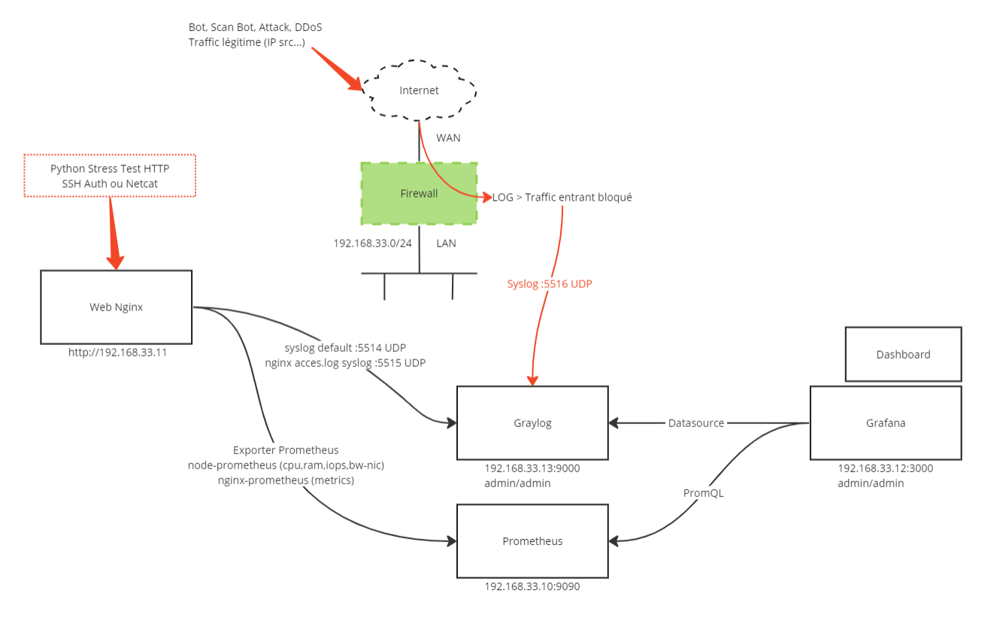

# COURS et LAB - Mesurer et analyser  le niveau de sécurité de l'infrastructure

### Lire le cours dans un 1er temps [ICI](Cours.md)

### Consignes du LAB sont ici [ICI](LAB.md)

### Diagram Topologie

